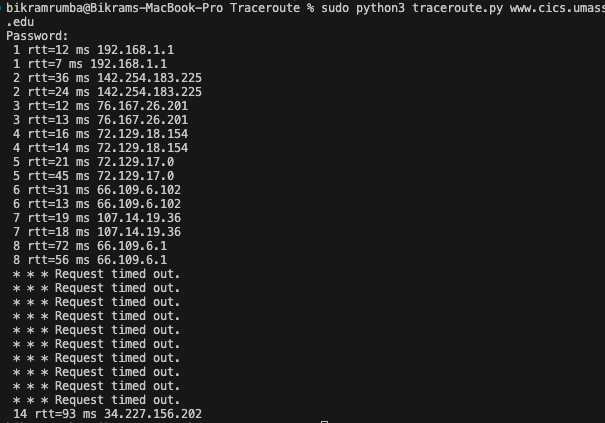

# ICMP Traceroute

A Python implementation of the traceroute network diagnostic tool using ICMP (Internet Control Message Protocol) echo requests.

## Overview

This program traces the route that packets take from the client computer to a destination host across the Internet. It shows each intermediate router (hop) along the path and measures the round-trip time (RTT) to each hop.

## How It Works

The traceroute program uses the IP Time-To-Live (TTL) field to discover routers along the path:

1. Sends ICMP echo request packets with incrementing TTL values (starting at 1)
2. Each router decrements the TTL by 1
3. When TTL reaches 0, the router sends back an ICMP "Time Exceeded" message (Type 11)
4. This reveals the router's IP address and allows RTT calculation
5. Process repeats with increasing TTL until the destination is reached (ICMP Echo Reply, Type 0)

## Requirements

- **Python 3.x**
- **Root/Administrator privileges** (required for creating raw sockets)
- **Operating System**: Linux, macOS, or Unix-based systems

## Installation

1. Save the program as `traceroute.py`
2. Ensure you have Python 3 installed:
   ```bash
   python3 --version
   ```

No additional packages are required - the program uses only Python standard library modules.

## Usage


### Examples

```bash
# Trace route to a domain name
sudo python3 traceroute.py www.google.com

# Trace route to an IP address
sudo python3 traceroute.py 8.8.8.8

# Trace route to a university server
sudo python3 traceroute.py www.cics.umass.edu
```

## Understanding the Results

### Successful Hops
When we see a line like `3 rtt=20 ms 72.14.215.85`, it means:
- This is the 3rd router in the path
- It took 20 milliseconds for the round trip
- The router's IP address is 72.14.215.85

### Timeouts
`* * * Request timed out.` messages are **normal** and occur when:
- Routers are configured not to respond to ICMP
- Firewalls block ICMP packets
- Routers implement rate limiting on ICMP responses
- Security policies prevent ICMP Time Exceeded messages

**Important**: Timeouts don't mean packets aren't being forwarded - routers still forward  traffic even if they don't respond to traceroute.

### Special Messages
- `(Destination Unreachable)`: The destination cannot be reached
- Program stops when destination responds with ICMP Echo Reply

## Configuration

You can modify these constants at the top of the program:

```python
ICMP_ECHO_REQUEST = 8    # ICMP type for echo request
MAX_HOPS = 30            # Maximum number of hops to try
TIMEOUT = 2.0            # Timeout in seconds for each probe
TRIES = 2                # Number of attempts per hop
```

### Adjusting Parameters

**Increase MAX_HOPS** if you need to trace longer routes:
```python
MAX_HOPS = 50
```

**Increase TIMEOUT** for slower networks:
```python
TIMEOUT = 5.0
```

**Increase TRIES** for more reliable results:
```python
TRIES = 3
```

## Troubleshooting

### "Operation not permitted" Error
**Solution**: Run with `sudo`
```bash
sudo python3 traceroute.py hostname
```

### "Permission denied" Error
**Cause**: Raw socket creation requires root privileges

**Solution**: Use `sudo` (macOS/Linux)

### All Requests Timeout
**Possible causes**:
- Firewall blocking ICMP traffic
- Destination host blocking ICMP
- Network doesn't allow ICMP traceroute

**Solution**: Try a different destination known to respond to ICMP (e.g., `8.8.8.8`)

### "Name or service not known" Error
**Cause**: Invalid hostname or DNS resolution failure

**Solution**: 
- Check hostname spelling
- Try using an IP address instead
- Check your internet connection

## How This Differs from System Traceroute

**System traceroute** (the built-in command):
- May use UDP or ICMP
- More features (AS numbers, geographic info)
- Highly optimized

**This implementation**:
- Uses only ICMP echo requests
- Educational/demonstration purpose
- Shows the core algorithm clearly
- Simpler output format

### Socket Type
The program uses `SOCK_RAW` with `IPPROTO_ICMP` to send/receive ICMP packets directly.

## Security Considerations

1. **Requires root privileges**: Raw sockets are privileged operations
2. **Network visibility**: Traceroute reveals network topology
3. **Rate limiting**: Some networks may rate-limit or block ICMP
4. **Firewall rules**: May need firewall adjustments in restricted environments

## Limitations

1. **Cannot trace UDP/TCP paths**: Only ICMP-based tracing
2. **Asymmetric routing**: Return path may differ from forward path
3. **Load balancing**: Multiple runs may show different routes
4. **ICMP filtering**: Many networks filter ICMP for security
5. **Incomplete paths**: May not reach destination if ICMP is blocked

## Example Session


